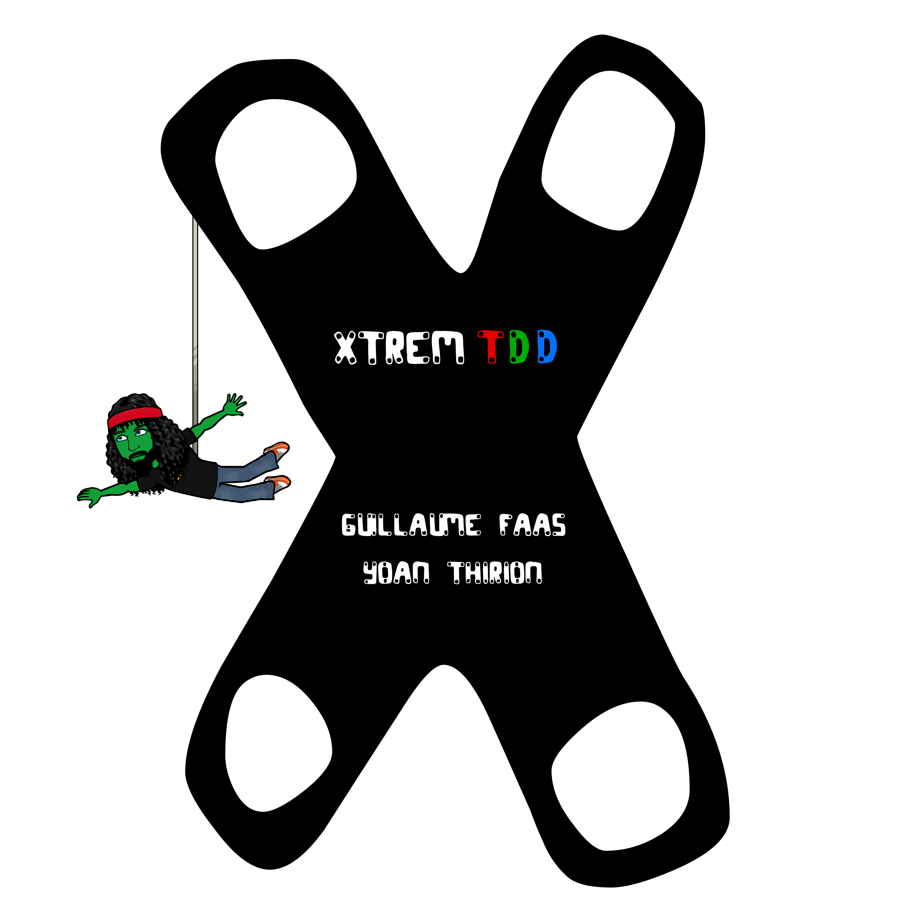

## Membres de l'équipe :

-LAPORTE Pierre
-LEVRAULT Damien
-BIBARD Yann
-NUNES Theo
-MERCIER-TALLET Yanis

# Xtrem Craft workshop

This workshop is based on the [Xtrem TDD workshop](https://github.com/les-tontons-crafters/xtrem-tdd-money-kata), 
by [Yoan Thirion](https://github.com/ythirion) and [Guillaume Faas](https://github.com/Tr00d)  

Here is the pitch of it :

```markdown
You have probably already heard or practiced Test-Driven Development (TDD) but have you already tried it in an Xtrem way?

What do we mean by Xtrem?
We propose to practice TDD on a kata using mob programming and introducing different constraints that you will pick randomly. We expect you to find smart ways to overcome those constraints.

Those constraints can be of different types : Design, Testing, Practice, Architecture.

Here are some example of constraints that we have documented on our website :
- Use TCR workflow (Test && Commit || Revert)
- Use a Test DataBuilder
- Check your dependency freshness with libyear
- Write only pure functions
- Make at least 2 refactorings after a passing test
- Write your next test using Approval Testing approach
- Check the quality of your tests with Mutation Testing
- and much more ...

By overcoming those constraints you will learn new ways of designing your code that you will be able to use in your day-to-day.
```



The changes made tend to adapt the content to an apprentice developer audience (like students) to work on a large panel of the software craftsmanship practices. 

#### Prerequisites
You need to install the runtime environment for the language you prefer use:

- C# : [.NET 6](https://dotnet.microsoft.com/en-us/download/dotnet/6.0)
- java : [SDK 17](https://www.oracle.com/java/technologies/downloads/)
- php : [PHP >= 7.4](https://www.php.net/manual/en/install.php)
- Typescript : [node >= 18.12](https://docs.npmjs.com/downloading-and-installing-node-js-and-npm)
- Scala 2 : `scala 2.13.8`

#### Workshop structure
We have structured this workshop using the [4C model](https://www.bowperson.com/2017/11/reposting-a-quick-guide-to-the-4cs-map/) :

- `Connection` : Help learners make connections with the topic of the workshop
- `Concepts` : Direct instruction, lecture or presentation part
- `Concrete Practice` : Learners actively practice a new skill using the new information
- `Conclusion` :  Learners summarize what they have learned

## Workshop
- [Connection](docs/connection.md)
- [Concepts](docs/concepts.md)
- [Concrete Practice](docs/facilitation.md)
- [Conclusion](docs/conclusion.md)
