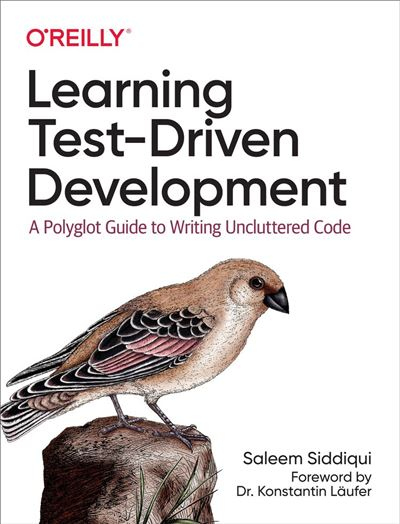

# Money Problem
This kata comes from [Saleem Siddiqui](https://www.linkedin.com/in/ssiddiqui/) 's book

[](https://www.oreilly.com/library/view/learning-test-driven-development/9781098106461/)

## What's the problem ?
We have  to build a spreadsheet to manage money in more than one currency : perhaps to manage a stock portfolio ?

| Stock | Stock exchange | Shares | Share Price | Total |
|---|---|---|---|---|
| IBM | NASDAQ | 100 | 124 USD | 12400 USD |
| BMW | DAX | 400 | 75 EUR | 30000 EUR |
| Samsung | KSE | 300 | 68000 KRW | 20400000 KRW |

To build it, we'd need to do simple arithmetic operations on numbers :

```text
5 USD x 2 = 10 USD
4002 KRW / 4 = 1000.5 KRW

// convert
5 USD + 10 EUR = 17 USD
1 USD + 1100 KRW = 2200 KRW
```

* We can use this table to determine exchange rates :

| From | To   | Rate    |
|------|------|---------|
| EUR  | USD  | 1.2     |
| USD  | EUR  | 0.82    |
| USD  | KRW  | 1100    |
| KRW  | EUR  | 0.0009  |
| EUR  | KRW  | 1344    |
| KRW  | EUR  | 0.00073 |

## List of Features to implement
We have already started the implementation by using TDD. We have discovered examples that helped us drive our implementation.

```text
Money Calculator :
✅ 10 EUR x 2 = 20 EUR
✅ 4002 KRW / 4 = 1000.5 KRW
✅ 5 USD + 10 USD = 15 USD

Bank implementation :
✅ Determine exchange rate based on the currencies involved (from -> to)
✅ Improve the implementation of exchange rates
✅ Allow exchange rates to be modified
```

## Iterations

- [Software Craftsmanship](https://pitchart.github.io/dawin-software-craftsmanship/#/1) 
  - [Agilité](https://pitchart.github.io/dawin-software-craftsmanship/#/1/3)
  - [Software craftsmanship manifesto](https://pitchart.github.io/dawin-software-craftsmanship/#/1/8)
  - [Valeurs, principes, pratiques](https://pitchart.github.io/dawin-software-craftsmanship/#/1/10)
- [Code review](https://pitchart.github.io/dawin-software-craftsmanship/#/2/7)
  - [Concrete Practice: Pair code review sur le money kata](./step-by-step/01-code-review.md)
- [Clean code](https://pitchart.github.io/dawin-software-craftsmanship/#/4)
  - [Concrete Practice: Dirty code / Clean Code](./step-by-step/02-dirty-code-clean-code.md)
- [Mob programming](https://pitchart.github.io/dawin-software-craftsmanship/#/2/4)
  - [Concrete practice: Refactoring expressivité du code](./step-by-step/03-expressive-code.md)
- [Unit testing](https://pitchart.github.io/dawin-software-craftsmanship/#/3)
  - [Concrete Practice: Test anatomy](./step-by-step/04-test-anatomy.md)
- [Quality metrics](https://pitchart.github.io/dawin-software-craftsmanship/#/4/6)
  - [Concrete Practice: Mutation testing](./step-by-step/05-mutation-testing.md)
- [Mob programming extended](https://pitchart.github.io/dawin-software-craftsmanship/#/2/6)
- [Test Driven Development](https://pitchart.github.io/dawin-software-craftsmanship/#/3/9)
  - [Concrete Practice: Implement Portfolio](./step-by-step/07-test-driven-development.md)
- [Continuous Integration / Continuous Delivery](https://pitchart.github.io/dawin-software-craftsmanship/#/2/8)
  - [Concrete Practice: test pipeline](./step-by-step/07-continuous-integration.md)
- [SOLID / Supple Design](https://pitchart.github.io/dawin-software-craftsmanship/#/4/17)
  - [Concrete Practice: Fight primitive obsession](./step-by-step/08-fight-primitive-obsession.md)
- [Example mapping]()
  - [Concrete Pratice: Backlog refinement](./step-by-step/10-example-mapping.md)
- [Test Data Builders]()
  - [Concrete Practice: Redesign the bank](./step-by-step/11-implement-test-data-builder.md)
- [Refactoring with tests]()
  - [Concrete Practice: Redesign the bank](./step-by-step/12-redesign-the-bank.md)
- [Rétrospective](./step-by-step/13-agile-retrospective.md)
