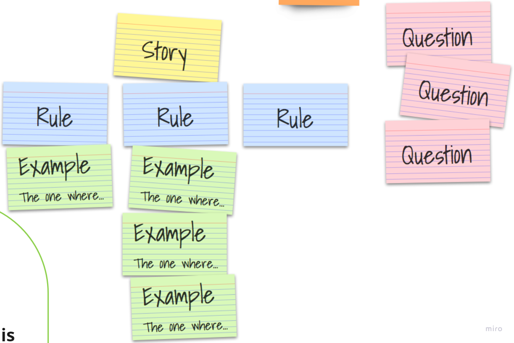

## Example Mapping

Prendre quelques instants pour lire à propos de l'[Example Mapping](https://xtrem-tdd.netlify.app/Flavours/example-mapping).

### Le problème
Nous avons travaillé avec les experts métier et nous avons identifié un problème dans la gestion des taux de changes.

| From | To   | Rate    |
|------|------|---------|
| EUR  | USD  | 1.2     |
| USD  | EUR  | 0.82    |
| USD  | KRW  | 1100    |
| KRW  | EUR  | 0.0009  |
| EUR  | KRW  | 1344    |
| KRW  | EUR  | 0.00073 |

- Nous avons 2 lignes de conversion `KRW` vers `EUR`
- Nous avons échangé avec nos experts, et ils nous ont expliqué qu'ils avaient *simplement* saisi la mauvaise devise de destination (To) sur la ligne 4 (apparemment, cela arrive souvent ...)

Après correction, la table de conversion est donc :

| From | To  | Rate    |
|------|-----|---------|
| EUR  | USD | 1.2     |
| USD  | EUR | 0.82    |
| USD  | KRW | 1100    |
| KRW  | USD | 0.0009  |
| EUR  | KRW | 1344    |
| KRW  | EUR | 0.00073 |

Nous ne sommes pas complètement confiants dans cette table qui est l'élément central de notre système
- Nous avons encore échangé avec nos experts métier sur un moyen de consolider cette table
- La conclusion est que nous pouvons l'améliorer facilement en vérifiant ce qu'ils appellent *Round-Tripping* : `from(to(x)) == x`

En d'autres termes :

```gherkin
Given an original amount in currency A
When we convert it to currency B and convert it back to currency A
Then we should receive the original amount 
```

A cette étape, nous constatons :
- Des invariants / règles métier manquants
- un manque d'alignement sur la compréhension du fonctionnement de la banque avec nos experts métier

Nous avons demandé aux experts métier d'être plus explicites sur les fonctionnalités fournies par une banque.

Ils ont travaillé sur le sujet et ont rédigé des **User Stories** et défini des concepts à ajouter à notre **Ubiquitous Language**. 

- **Story 1: Define Pivot Currency**
```gherkin
As a Foreign Exchange Expert
I want to be able to define a Pivot Currency
So that I can express exchange rates based on it
```
- **Story 2: Add an exchange rate**
```gherkin
As a Foreign Exchange Expert
I want to add/update exchange rates by specifying: a multiplier rate and a currency
So they can be used to evaluate client portfolios
```
- **Story 3: Convert a Money**
```gherkin
As a Bank Consumer
I want to convert a given amount in currency into another currency
So it can be used to evaluate client portfolios
```

## Ubiquitous Language

**Pivot Currency**: La devise pivot est la devise grâce à laquelle les valeurs des autres devises sont calculées

## Fonctionnement d'une devise pivot ?

L'utilisation de la devise pivot pour la conversion de devises s'illustre le mieux en utilisant des exemples.

Tous les taux de change doivent être définis de la devise pivot vers une autre devise.

| Currency | Example 1 Rate from EUR to ... | Example 2 Rate from JPY to ... |
|----------|--------------------------------|--------------------------------|
| GBP      | 1.5                            | 3.0                            |
| USD      | 2.0                            | 2.0                            |

## Example mapping



- Commencer par écrire la *User Story* à affiner (sur un post-it jaune) et la placer au centre de la table
- Ensuite, écrire chaque critère d'acceptation ou règle métier existante sur un post-it bleu et les placer sous celui de la User Story.
- Pour chaque règle, nous avons besoin d'un ou plusieurs exemples pour les illustrer. Les écrire sur des post-it verts et les placer sous la règle correspondante.
- En échangeant sur ces exemples, vous pouvez découvrir des questions pour lesquelles personne autour de la table ne peut répondre : les écrire sur des post-it rouges et continuer la conversation. 

## Format de restitution
(pour chaque US)

### Titre de l'US (post-it jaunes)

> Question (post-it rouge)
 
#### Règle Métier (post-it bleu)

Exemple: (post-it vert)
```gherkin
Given ...
When ...
Then ...
```

### Conversion de devises

> Que se passe-t-il si nous voulons convertir dans une devise inconnue du système ?

#### Erreur en cas de devise inconnue
```gherkin
Given a bank with Euro as Pivot Currency
When I convert 10 Euros to Korean Wons
Then I receive an error explaining that the system has no exchange rate
```


